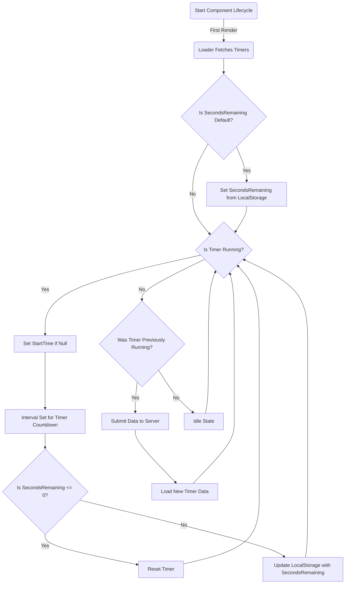
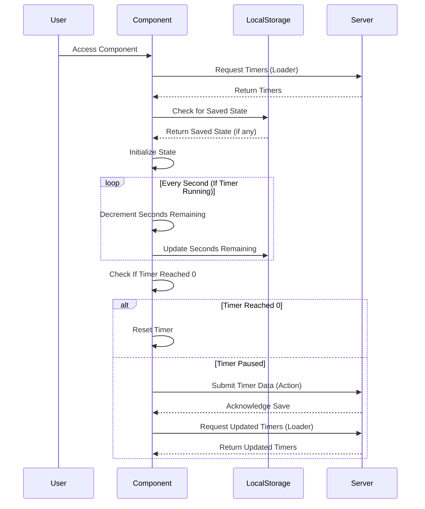
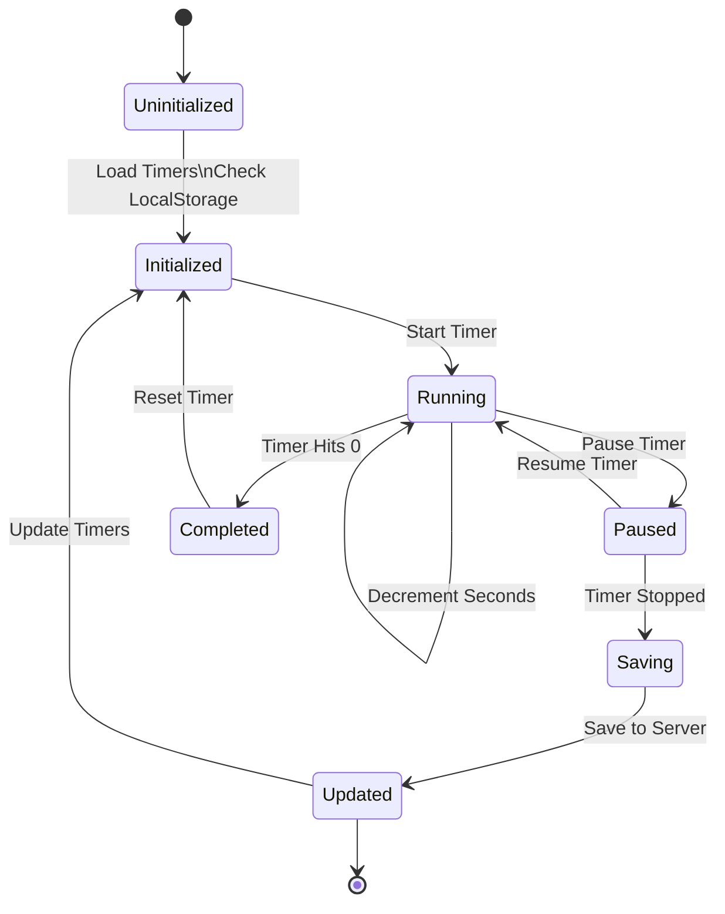

Flow Chart

```mermaid
graph TD
    A(Start Component Lifecycle) -->|First Render| B(Loader Fetches Timers)
    B --> C{Is SecondsRemaining Default?}
    C -->|Yes| D[Set SecondsRemaining from LocalStorage]
    C -->|No| E{Is Timer Running?}
    E -->|Yes| F[Set StartTime if Null]
    F --> G[Interval Set for Timer Countdown]
    G --> H{Is SecondsRemaining <= 0?}
    H -->|Yes| I[Reset Timer]
    H -->|No| J[Update LocalStorage with SecondsRemaining]
    E -->|No| K{Was Timer Previously Running?}
    K -->|Yes| L[Submit Data to Server]
    L --> M[Load New Timer Data]
    K -->|No| N[Idle State]
    D --> E
    I --> E
    J --> E
    M --> E
    N --> E
```

Sequence Diagram

```mermaid
sequenceDiagram
    participant U as User
    participant C as Component
    participant LS as LocalStorage
    participant S as Server

    U->>C: Access Component
    C->>S: Request Timers (Loader)
    S-->>C: Return Timers
    C->>LS: Check for Saved State
    LS-->>C: Return Saved State (if any)
    C->>C: Initialize State

    loop Every Second (If Timer Running)
        C->>C: Decrement Seconds Remaining
        C->>LS: Update Seconds Remaining
    end

    C->>C: Check If Timer Reached 0
    alt Timer Reached 0
        C->>C: Reset Timer
    else Timer Paused
        C->>S: Submit Timer Data (Action)
        S-->>C: Acknowledge Save
        C->>S: Request Updated Timers (Loader)
        S-->>C: Return Updated Timers
    end

```

State Diagram

```mermaid
stateDiagram-v2
    [*] --> Uninitialized
    Uninitialized --> Initialized: Load Timers\nCheck LocalStorage
    Initialized --> Running: Start Timer
    Running --> Running: Decrement Seconds
    Running --> Paused: Pause Timer
    Paused --> Running: Resume Timer
    Paused --> Saving: Timer Stopped
    Running --> Completed: Timer Hits 0
    Completed --> Initialized: Reset Timer
    Saving --> Updated: Save to Server
    Updated --> Initialized: Update Timers
    Updated --> [*]

```
